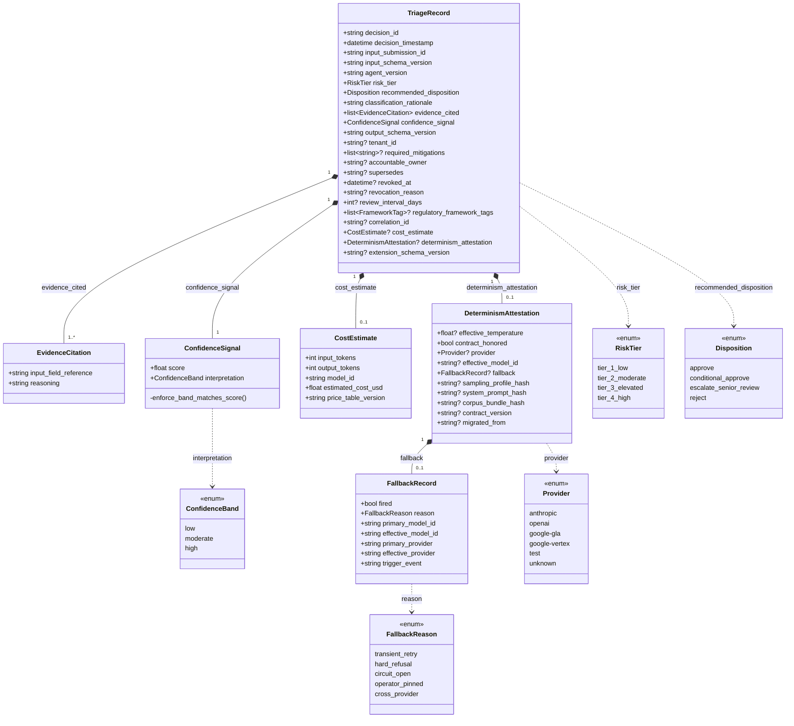
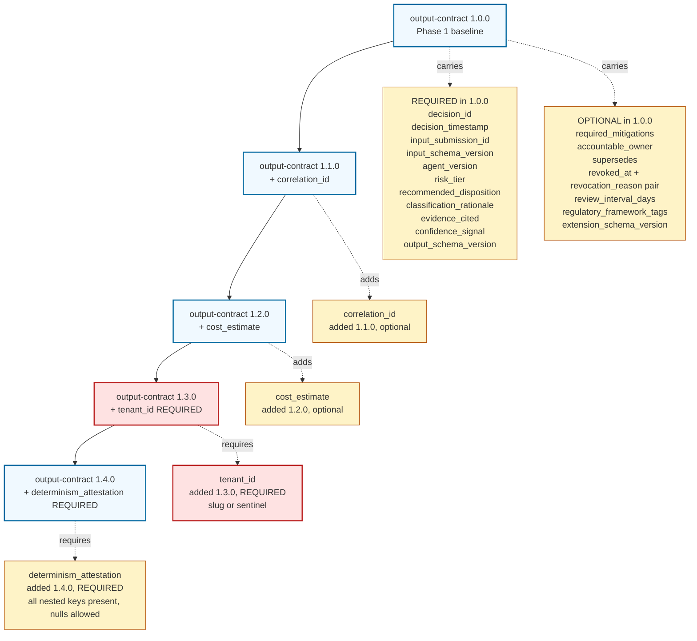
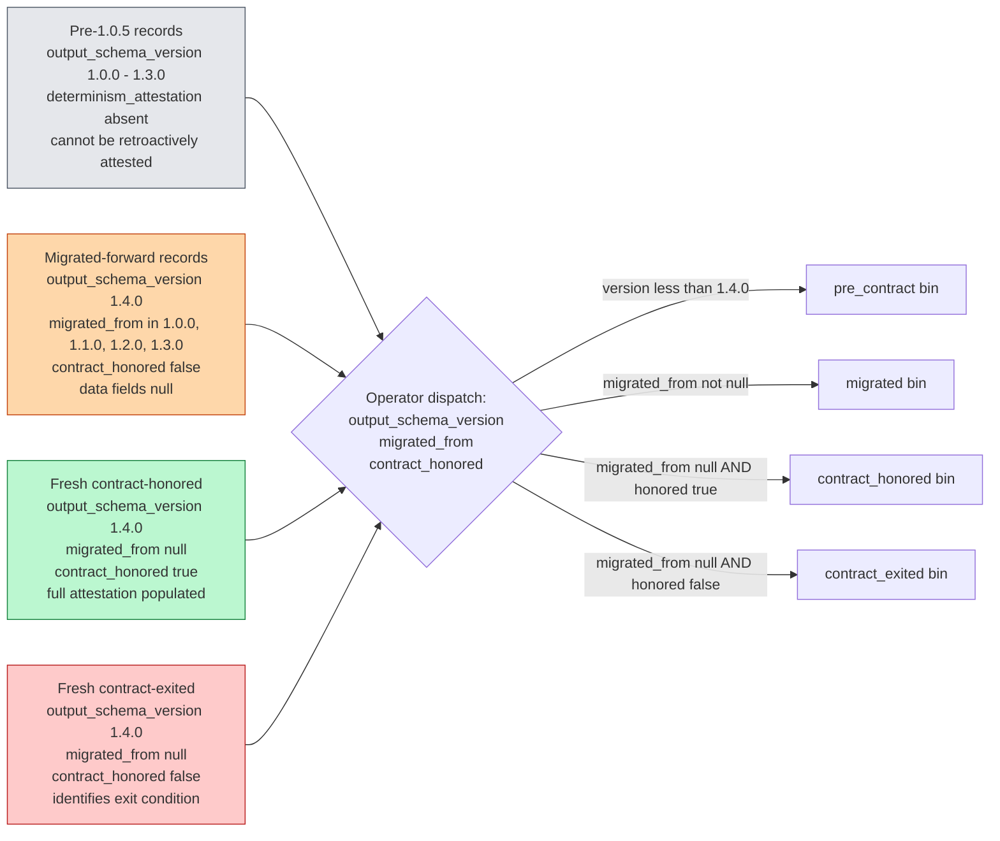
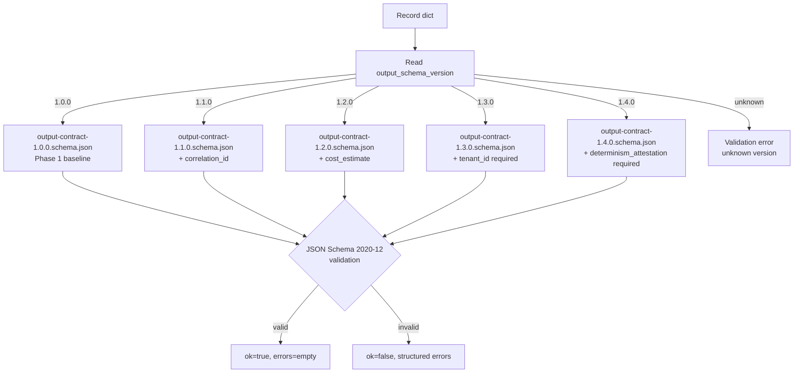
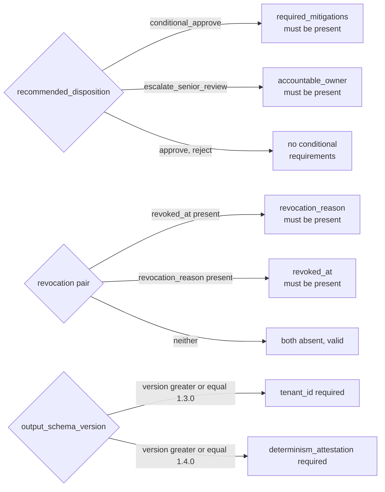

# Data model

The Vendor Risk Triage agent's data model is published as a JSON Schema
contract (`schemas/output-contract-{version}.schema.json`) and enforced
at runtime by Pydantic models (`agent/output_models.py`). The contract
is the source of truth; the Pydantic models conform to it and reject
anything the schema would reject (plus several additional defenses).

This document is the visual anchor for `docs/phase-1/03-output-contract.md`
(per-field specification) and `docs/determinism-attestation.md` (the
contract introduced in 1.0.5).

## TriageRecord and nested types

## Newly REQUIRED fields by contract version

The output contract evolved 1.0.0 -> 1.1.0 -> 1.2.0 -> 1.3.0 -> 1.4.0.
Earlier records remain valid against their version-of-record schema via
the dispatcher in `schemas/validate.py`. The diagram below shows only
the fields that became NEWLY REQUIRED at each version hop. The full
field inventory at 1.0.0 baseline is broader; see the class diagram
above and the per-field specification at
`docs/phase-1/03-output-contract.md` for the complete list.

## Four populations of records

After 1.0.5 ships, four populations of records coexist (the three
populations in the contract docstring decompose to four for operator
dispatch: fresh records split into contract-honored and
contract-exited). Operators distinguish them by inspecting
`(output_schema_version, migrated_from, contract_honored)` and route on
the resulting four-bin discriminator. The dispatch order is:

1. Check `output_schema_version` first: pre-1.4.0 records have no attestation.
2. Then check `migrated_from` truthiness: any non-null value identifies a migrated record (sourced from 1.0.0, 1.1.0, 1.2.0, or 1.3.0).
3. Then check `contract_honored`: separates fresh records into honored vs exited.

## Schema dispatch

`schemas.validate.validate_output` dispatches on the record's declared
`output_schema_version` so older records continue to validate against
their version-of-record schema. Every schema file is preserved in the
repo for the life of the project.

## Pydantic enforcement

`agent.output_models.TriageRecord` is the runtime enforcement of the
JSON Schema contract. It carries:

- **Frozen models**: every model is `frozen=True` (tamper resistance).
- **Extra forbidden**: `extra="forbid"` on every model (no silent drift).
- **Cross-field validation**: a model-validator enforces the schema's
  `allOf` and `dependentRequired` rules so Pydantic and the JSON Schema
  reject the same instances for the same reasons.
- **Version-conditional enforcement**: declared `output_schema_version`
  gates conditional requirements (1.3.0+ requires `tenant_id`; 1.4.0+
  requires `determinism_attestation`).
- **Control character rejection**: free-text fields screen for log
  injection and ANSI escape sequences.
- **Datetime serialization**: RFC 3339 UTC with minimum fractional-second
  digits via a custom field serializer.
- **Attestation expansion on dump**: `model_dump` overrides
  `exclude_none` for the determinism attestation so every nested key
  is structurally present in serialized output (null means absent).

## Conditional requirements

## Cross-references

- Per-field specification: `docs/phase-1/03-output-contract.md`
- Determinism contract text: `docs/determinism-attestation.md`
- Schema files: `schemas/output-contract-{1.0.0, 1.1.0, 1.2.0, 1.3.0, 1.4.0}.schema.json`
- Pydantic models: `agent/output_models.py`
- Dispatcher: `schemas/validate.py`
- Migration engine: `migration/engine.py` (handles version hops including the 1.3.0 -> 1.4.0 attestation hop)
