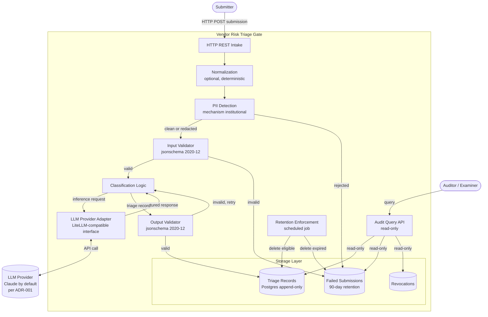

# Phase 2: System Architecture

Component-level decomposition of the Vendor Risk Triage gate. This document specifies what the system is built from, how its components fit together, and what flows between them. The architectural decisions behind each choice live in docs/phase-2/04-architecture-decisions.md; this document specifies the resulting architecture.

## Reading this

This document is the visual anchor for Phase 2. The system architecture defined here is referenced by docs/phase-2/02-trust-boundaries.md (which identifies what is inside the trust boundary and what is outside) and docs/phase-2/03-threat-model.md (which maps threats against the components named here).

Forks of the framework adapt the component set, the data flow, and the deployment specifics to their regulatory context. The architectural patterns documented here are intended as a defensible reference, not a prescriptive standard.

## Architecture overview

The Vendor Risk Triage gate takes a vendor documentation submission, validates it against a published input contract, classifies the vendor against a defined risk taxonomy via a large language model, and produces an immutable triage record conforming to a published output contract. The record carries a recommended risk tier (tier_1_low, tier_2_moderate, tier_3_elevated, tier_4_high) and a recommended disposition (approve, conditional_approve, escalate_senior_review, reject). The recommendation and its written rationale are the gate's product; the final decision belongs to the human reviewer per Phase 0's problem definition. Every step is auditable. Every record is reconstructable.

The architecture separates the gate's internal components from external dependencies. The internal components are owned by the deploying institution and live inside its trust boundary. External dependencies (the LLM provider, the submitter, the auditor) are explicitly outside that boundary and engage with the gate through defined interfaces.

The architecture also separates durable architectural commitments from configurable deployment specifics. The architecture documented here is the durable commitment. The specific LLM provider, the specific Postgres host, the specific PII detection mechanism, and the specific retention period are deployment configuration that institutions adapt to their context.

## Architecture diagram

The diagram below shows the gate's components, the external actors and dependencies that interact with it, and the data flow from submission through record storage.

## Components

**HTTP REST Intake**

The transport boundary. Accepts submissions as HTTP POST requests with JSON bodies. Returns either a validation error response (4xx with structured error details) or the completed triage record (2xx). Authentication and authorization are infrastructure concerns owned by the institution's API gateway or service mesh, not by the gate's application code.

**Normalization**

Optional, deterministic transformation of semi-structured submissions into shapes that conform to the input contract. CSV exports, completed questionnaire forms, and similar formats route through this step. Submissions already conforming to the contract pass through unchanged. The transformation is documented and reproducible, so the path from raw input to validated submission is auditable.

**PII Detection**

Inline detection of incidental personal information before classification. Submissions containing PII the contract did not request are either redacted in place (with the redaction noted in the audit trail) or rejected with a request to redact and resubmit. The detection mechanism is the institution's choice per the Phase 1 privacy spec (docs/phase-1/04-privacy-and-data-handling.md); the architecture defines the step's placement in the pipeline regardless of mechanism.

**Input Validator**

Validates the (potentially normalized, PII-cleaned) submission against the input contract (docs/phase-1/02-input-contract.md). Uses the jsonschema Python library per ADR-004, instantiated with the schema version specified in the submission's schema_version field. A submission that fails validation is routed to the failed submissions store with a structured error naming each failing field.

**Classification Logic**

The agent's reasoning. Constructs the inference request from the validated submission, invokes the LLM provider adapter, and assembles the resulting triage record. The classification logic is provider-agnostic; it does not know which LLM produced the inference. Provider specifics are absorbed by the adapter.

Prompt versioning is implicit in agent_version (per ADR-003): the prompt files live in the codebase, so the git commit SHA that produced a record names both the agent code and the prompt version it ran with. A prompt change is a commit; the agent_version field captures it. Institutions modifying prompts through deployment-specific configuration (rather than codebase changes) extend agent_version to capture both the code version and the prompt configuration version.

**LLM Provider Adapter**

Implements the provider-agnostic LLM interface defined in ADR-001. The reference implementation includes one adapter: Anthropic Claude via direct API. The adapter translates the classifier's structured inference request into provider-specific API calls, captures the response, and translates it back into the structured format the output validator expects. The interface is designed LiteLLM-compatible so institutions operationalizing the framework can swap in LiteLLM or another multi-provider library.

**Output Validator**

Validates the triage record produced by the classifier against the output contract (docs/phase-1/03-output-contract.md). Uses the jsonschema Python library per ADR-004, instantiated with the current output schema version. A record that fails validation is treated as an incomplete decision and is not written to storage; the classifier is invoked to produce a conforming record before the decision is considered complete.

**Triage Records store**

Append-only Postgres table holding immutable triage records. Per ADR-005, the application role has INSERT only; UPDATE and DELETE are not granted. Supersession is implemented through new records linked to prior decision_ids; revocation is implemented through the separate Revocations table. Each record carries the output_schema_version it was written under; per ADR-006, records are not retroactively migrated when the schema evolves, so reads are schema-version-aware and the store may hold multiple schema versions at once.

**Failed Submissions store**

Postgres table holding submissions that failed validation or were rejected for PII reasons. Retained for 90 days per the Phase 1 privacy spec, separate from the triage records retention period. Failed submissions are part of the audit trail (the institution can see what was turned away and why) but are not decisions.

**Revocations store**

Postgres table joining to records by decision_id. Revoking a record marks it (with revoked_at and revocation_reason) without modifying the original record. Per the output contract and ADR-005, revoked records remain visible in the audit trail; the supersession chain reflects the current state.

**Audit Query API**

Read-only API for examiner and program-owner queries. Supports the patterns the contracts imply: lookup by decision_id, vendor history, supersession chain traversal, failed submission lookup, and revocation status. The API does not provide write access to any storage table. Authentication and authorization for auditors and program owners are institutional configuration.

**Retention Enforcement**

Scheduled job that deletes records past the configured retention period. A dedicated retention-enforcement role has DELETE permission scoped through row-level security policies that gate eligibility by decision_timestamp plus the configured retention period. The application role itself never has DELETE access. The job runs daily by default; the institution may configure a different cadence.

## Data flow

A typical submission moves through the gate in the following sequence.

The submitter sends an HTTP POST to the gate's intake endpoint with a JSON body. The transport layer accepts the request and routes the body through normalization. If the submission is already contract-shaped, normalization passes it through unchanged. If not, the normalization step transforms it deterministically.

PII detection inspects the normalized submission. Submissions containing personal information the contract did not request are either redacted (with the redaction recorded) or rejected and stored in the Failed Submissions store with the rejection reason. Clean submissions continue.

The Input Validator checks the submission against the input contract using the schema version named in the submission's schema_version field. Validation failures route the submission to the Failed Submissions store with structured error details. Valid submissions proceed.

The Classification Logic constructs an inference request from the validated submission and invokes the LLM Provider Adapter. The adapter calls the configured LLM provider (Claude by default), receives the response, and returns a structured result to the classifier. The classifier assembles a triage record per the output contract.

The Output Validator checks the assembled record against the output contract. Records that fail validation are not written to storage; the classifier is invoked again to produce a conforming record. Valid records are written to the Triage Records store via the application role's INSERT permission.

Auditors and program owners query records, failed submissions, and revocations through the read-only Audit Query API. The retention enforcement job runs on schedule and deletes records past the configured retention period using the retention-enforcement role's narrowly scoped DELETE permission.

## Idempotency and duplicate detection

The intake transport supports idempotent submission. A submission identity is the tuple (vendor_id, set of content_hashes from documentation_artifacts, prior_triage_record_id or null). When a submission with the same identity arrives a second time, the intake returns the existing triage record rather than producing a duplicate decision.

Idempotency requires content_hash on documentation_artifacts. The field is optional in the input contract; when absent, duplicate detection is best-effort. Institutions wanting reliable idempotency configure submitters to compute SHA-256 content_hash for every artifact before submission.

Re-triage is distinct from retry. A reviewer intentionally requesting a fresh triage submits with prior_triage_record_id pointing to the existing record; this signals re-review and produces a new record with supersedes linkage. The duplicate-detection check excludes submissions carrying prior_triage_record_id, so re-triage is never blocked by idempotency.

## Human review and override workflow

The gate produces recommendations; humans decide. The architecture supports the human review and override workflow through existing components without requiring a separate review queue service.

After classification, every record lands in the Triage Records store with its recommended risk tier and recommended disposition. The program owner (the VP or Director of Compliance, per Phase 0) and the compliance reviewer (the primary user, per Phase 0) read records through the Audit Query API. The same API serves examiner queries and internal review queries; the access boundary is institutional configuration on top of the read-only API.

When a reviewer overrides a recommendation, the override is implemented as a new triage submission. The reviewer (or an integration acting on their behalf) submits a new submission through the intake transport with the prior record's decision_id as the prior_triage_record_id field. The system processes it as a new triage decision, produces a new record, and writes that record with the supersedes field pointing to the prior decision. The supersession chain reflects the current decision state without modifying any prior record.

Revocations follow a different pattern. A revocation marks a record without superseding it (no new triage decision is implied), per the output contract's revoked_at and revocation_reason fields. The Revocations store holds the marker; the original record remains visible in the audit trail unchanged.

The architecture commits to these two patterns (override-via-supersession and revocation-via-marker). The specific UI for reviewers to read recommendations and trigger overrides is institutional configuration (a web app, a Slack notification with action buttons, a GRC platform integration, etc.). The forthcoming Phase 4 (Human-in-the-Loop Review Workflow) of the roadmap specifies the reference implementation's UI; this architecture document specifies the data path.

## External dependencies

The gate depends on three categories of external system.

The LLM provider (Anthropic Claude by default, per ADR-001) is the primary external dependency. Provider availability, pricing, region routing, and safety behavior are governed by the provider's own service terms. The gate's reliability inherits the provider's reliability. ADR-002 describes the data processing region strategy for the LLM provider, including the cross-region inference caveats institutions must verify before deployment.

The Postgres database (Supabase by default per ADR-005, with other deployment options available) provides the storage layer. The gate's data durability and availability inherit the database's. Backup, replication, and disaster recovery are deployment configuration owned by the institution.

The PII detection mechanism (institutional choice per Phase 1 privacy spec) is an external dependency only when the institution chooses a managed service (Microsoft Purview, AWS Comprehend, BigID, etc.). When the institution chooses an in-process mechanism (regex, Presidio, etc.), PII detection is an internal component without external dependency.

## Trust boundaries

The trust boundary cuts between the gate's internal components and its external dependencies. Submitters, auditors, and the LLM provider are explicitly outside the trust boundary. The intake transport, normalization, PII detection, validation, classification, adapter, output validation, storage, audit API, and retention job are all inside.

Detailed trust boundary analysis, including the third-party AI components that sit on the boundary and the regulatory implications of crossing it, lives in docs/phase-2/02-trust-boundaries.md.

## What this architecture does not cover

The exclusions below are the ones a reader might wrongly expect from this document. Items that naturally live in later phases or in deployment configuration are skipped here.

**Specific API endpoint URLs and request/response formats.** The HTTP REST intake is described as a transport pattern, not specified at the OpenAPI level. Endpoint design lives in Phase 3 (Build & Eval) deliverables.

**Authentication and authorization specifics.** The architecture identifies where auth happens (at the intake transport for submitters, at the audit API for examiners and program owners) but does not specify auth mechanism (API keys, OAuth, SAML, etc.). Auth is institutional configuration.

**Deployment infrastructure.** The architecture is host-agnostic. Whether the gate runs on Vercel, AWS Fargate, a Kubernetes cluster, or a single VM is deployment configuration that does not affect the architectural commitments documented here.

**Monitoring, logging, and observability infrastructure.** Operational logging (separate from audit log) is implementation detail. The architecture's commitment is to the audit trail; operational observability is whatever the institution's standard pattern is.

**Disaster recovery and backup architecture.** Database backup strategy, replication topology, and failover procedures are deployment configuration owned by the institution's infrastructure team.

**Confidence-gated routing and human-in-the-loop UI workflows.** Confidence calibration is deferred to Phase 3 per Phase 1's explicit deferral. The HITL UI is deferred to Phase 4. The output contract supports the data needed for both; the specific routing logic and review UI are forthcoming.

**Document attachment parsing.** PDF, DOCX, and similar document attachments are referenced through the documentation_artifacts field of the input contract, not parsed by the agent. They exist for the human reviewer; the agent classifies from structured fields, not from unstructured document contents. This is a deliberate architectural commitment that keeps the agent's input surface defined and reviewable. The reference implementation does not include OCR, document text extraction, or attachment-content reasoning.

**Retry, circuit breaker, and async patterns.** Operational concerns including LLM provider call retries, circuit breaking on provider outage, and async classification with queue plus webhook callback are deployment configuration owned by the institution. The synchronous HTTP REST default is suitable for the vendor onboarding cadence (single submission, 10-30 second LLM latency, no real-time SLA). Institutions with higher submission volume or stricter SLAs may add async patterns on top. (Request idempotency, in contrast, is an architectural commitment, documented in the Idempotency and duplicate detection section above.)

## Framework coverage

- **NIST AI RMF**: Map function (system context and component identification) and Govern function (architectural accountability). The documented component decomposition supports both functions.
- **EU AI Act**: Article 11 (technical documentation for high-risk AI systems). The system architecture is part of the technical documentation the article requires for high-risk AI systems.
- **OSFI E-23**: Model documentation requirements. Architecture documentation is part of the model documentation institutions maintain for federally regulated AI systems.
- **SOX ICFR**: IT general controls. When AI systems support financial reporting, the documented architecture establishes the systems in ICFR scope.

## Forward references

This architecture is built on by:

- docs/phase-2/02-trust-boundaries.md: explicit documentation of what is inside the trust boundary and what is outside, with the regulatory mapping of each boundary crossing
- docs/phase-2/03-threat-model.md: STRIDE-based and AI-specific threat analysis mapped against the components named here
- docs/phase-2/04-architecture-decisions.md: the rationale behind the architectural choices reflected in this document

## Status

Phase 2 (Architecture & Threat Model) of the sitkastack Framework, in progress as of May 24, 2026. This system architecture document publishes alongside the Phase 2 problem definition and architecture decisions documents. The trust boundaries and threat model documents are in active drafting.

## Author

Robyn Toor. Fifteen years shipping programs in fintech and SaaS, including fintech operating roles where vendor risk decisions came across my desk.
