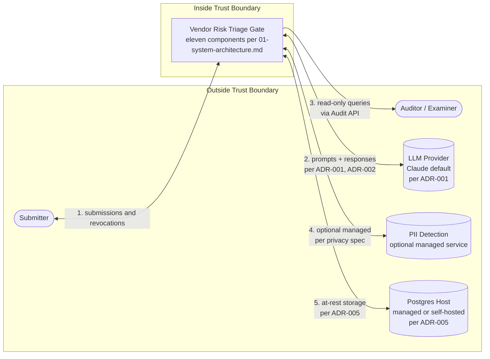

# Phase 2: Trust Boundaries

Explicit documentation of what is inside the Vendor Risk Triage gate's trust boundary, what is outside, and what crosses between them. AI systems with implicit trust boundaries create ambiguity for auditors and other reviewers trying to verify what the system does and where institutional accountability lies. Documenting boundaries explicitly removes that ambiguity.

## Reading this

This document builds on docs/phase-2/01-system-architecture.md, which decomposes the gate into its components. Where 01 specifies what each component does, this document specifies the trust assumptions for each component and the controls at each boundary crossing.

Forks of the framework adapt the boundary placement and the crossing controls to their regulatory context. The patterns documented here are intended as a defensible reference, not a prescriptive standard.

## Trust boundary overview

A trust boundary is a line that separates components that trust each other from components that do not. Inside the boundary, components can read each other's outputs without re-validating them. Outside the boundary, every input is untrusted until explicitly validated.

The Vendor Risk Triage gate's trust boundary is drawn around the components the deploying institution owns and controls. Submitters, auditors, the LLM provider, and (when institutionally configured) managed services for PII detection and Postgres hosting sit outside that boundary. Inside the boundary are the gate's eleven internal components: HTTP REST Intake, Normalization, PII Detection (when implemented in-process), Input Validator, Classification Logic, LLM Provider Adapter, Output Validator, Triage Records store, Failed Submissions store, Revocations store, Audit Query API, and Retention Enforcement.

The placement of components on either side of the boundary determines the controls each component requires. Components inside the boundary trust each other's outputs but validate everything that crosses in from outside. Components outside the boundary are governed by their own provider terms and by the contracts the institution negotiates with them. The boundary is not a network firewall; it is an accountability line.

## The boundary cut

The diagram below shows the boundary explicitly. The gate is shown as a single box (the internal decomposition lives in 01-system-architecture.md); the focus here is on what crosses the boundary, in which direction, and under what controls.

## Inside the trust boundary

The eleven components named in 01-system-architecture.md sit inside the trust boundary. The trust assumptions for each are:

**HTTP REST Intake** trusts that the deploying institution's API gateway has handled transport-layer authentication and TLS. It does not trust the request body; all content is validated downstream. On outbound responses, the intake transport carries content that has been validated through the gate's pipeline; the institution's authorization layer controls which submitters receive which response content.

**Normalization** trusts that the intake transport has authenticated the request. It does not trust the request body's shape; the transformation is documented and deterministic precisely because the input is not trusted to be contract-shaped.

**PII Detection** (when implemented in-process) trusts that normalization has produced parseable, inspectable content. It does not trust the content's conformance to the input contract; field-level inspection runs on whatever shape arrives. Submissions that fail PII detection are rejected before reaching validation.

**Input Validator** trusts that the upstream pipeline (normalization, PII detection) has produced content suitable for validation. It does not trust the content's conformance to the input contract; schema validation is the explicit gate, and failures route to the Failed Submissions store with structured error details.

**Classification Logic** trusts that the Input Validator has confirmed schema conformance. It treats the validated submission as trusted input for the inference request it constructs.

**LLM Provider Adapter** is the only internal component that crosses the trust boundary outward. The adapter trusts the inference request from Classification Logic. It does not trust the LLM provider's response at two layers: (1) the response may not conform to the provider's API contract (malformed JSON, missing fields, error responses), handled by the adapter's parsing and error handling; (2) the response content (classification, reasoning) is treated as untrusted business logic output, gated by the Output Validator before reaching storage.

**Output Validator** does not trust the assembled triage record from Classification Logic. Validation against the output contract is the explicit gate before the record is committed to storage.

**Triage Records store, Failed Submissions store, Revocations store** trust the application role's INSERT permission (per ADR-005) and the row-level security policies on the retention-enforcement role. The storage layer enforces append-only semantics regardless of what the application code does.

**Audit Query API** trusts the institution's authentication and authorization for examiners and program owners. The API is read-only; trust does not need to extend to write permissions because the API does not have them.

**Retention Enforcement** runs under a narrowly scoped role and trusts only the row-level security policies that gate eligibility for DELETE.

## Outside the trust boundary

Five categories of external entity sit outside the trust boundary.

**Submitters** are the entities that send vendor documentation to the gate's intake endpoint. They may be internal users of the institution (a compliance reviewer triggering a re-review), automated systems (a vendor management workflow forwarding new submissions), or external systems (a vendor self-service portal). Regardless of internal-vs-external network position, submitters are treated as untrusted at the gate boundary because the gate cannot verify the integrity of what they submit without validation.

**Auditors and examiners** are the entities that query the gate's records through the read-only Audit Query API. They may be internal (the institution's program owner, a board-level reviewer) or external (a regulator, an external auditor). The gate exposes records and audit trails to them through a controlled API, not direct database access.

**The LLM provider** (Anthropic Claude by default, per ADR-001) processes inference requests and returns responses. The provider sits outside the trust boundary. The institution selects the provider deliberately and contracts for specific service terms (zero data retention per ADR-001, region routing per ADR-002), but the gate does not trust the provider's response content; the response is structured by the contract and validated against the output contract.

**Managed PII detection services** (Microsoft Purview, AWS Comprehend, BigID, etc., when institutionally chosen) sit outside the boundary in the same way as the LLM provider. The institution sends data to the service and receives a detection result; the result is treated as advisory input to the gate's decision about whether to accept, redact, or reject the submission.

**Postgres hosts** (Supabase by default, with other deployment options available per ADR-005) hold data at rest outside the gate's process. The institution selects the host (managed service or self-hosted) and configures the role-based permissions that enforce append-only semantics. The data is the institution's; the host is the operational dependency.

## Boundary crossings

Each crossing has an entry, an exit, a data type, a trust assumption, a control, and a regulatory mapping. The five crossings are documented below.

### Crossing 1: Submitter to Intake Transport

This crossing is bidirectional. The submitter sends a request inbound; the gate returns a response outbound. Both directions carry trust implications.

**Entry / Exit:** Outside the boundary (submitter) to/from Inside the boundary (HTTP REST Intake).

**Data type:**
- Inbound: JSON body conforming (or claiming to conform) to the input contract for triage submissions, or to the revocation request schema for revocations (per the unified intake pattern in docs/phase-2/01-system-architecture.md).
- Outbound: triage record per the output contract for successful triage, revocation confirmation for successful revocations, or structured error details for failures.

**Trust assumption:**
- Inbound: untrusted. The submitter may be a hostile actor, misconfigured automation, or a legitimate reviewer; the gate makes no distinction at the transport layer until validation.
- Outbound: the institution must authorize the submitter to receive the specific response content. Internal reviewers receive full records; external portal submitters may receive limited subsets. The authorization model is institutional configuration on top of the transport.

**Control:** TLS at transport. Authentication at the API gateway. Full schema validation at the Input Validator with closure properties (per ADR-004) for triage submissions; schema validation for revocation requests at the same intake transport. PII detection inline for triage submissions. Response-side authorization governs what content is returned to which submitter.

**Regulatory mapping:**
- **NIST AI RMF**: Govern function. Input boundary controls are part of the system's accountability posture.
- **EU AI Act**: Article 15 (accuracy and robustness). Input validation is part of robustness for high-risk AI systems.
- **OSFI E-23**: Model input governance. Strict input validation supports the model integrity expectations.
- **SOX ICFR**: Control reliability. Inputs to controls supporting financial reporting are validated before processing.

### Crossing 2: LLM Provider Adapter to LLM Provider

**Entry:** Inside the boundary (LLM Provider Adapter).
**Exit:** Outside the boundary (LLM provider).
**Data type:** Structured inference request containing the validated submission's content. The submission may include vendor-confidential material and (when present despite intake-time PII detection) residual personal information.
**Trust assumption:** Outbound: the institution trusts the provider to honor its contracted service terms (zero data retention per ADR-001, region routing per ADR-002, processing only for the institution's request). Inbound: the response is structured by the contract but its content is treated as untrusted; the Classification Logic uses it but the Output Validator gates what reaches storage.
**Control:** Provider contract specifies retention and residency. ADR-001 specifies the provider choice. ADR-002 specifies the region configuration with cross-region inference caveats. The privacy spec (docs/phase-1/04-privacy-and-data-handling.md) governs what data is sent.
**Regulatory mapping:**
- **NIST AI RMF**: Govern function supply chain risk. The LLM provider is the most consequential supply chain dependency for an AI system.
- **EU AI Act**: Articles 25-29 (provider and deployer obligations). The institution is the deployer; the LLM provider is the provider; the boundary delineates where deployer obligations end and provider obligations begin.
- **OSFI E-23**: Third-party model oversight. The LLM is a third-party model and is subject to the institution's model risk management for federally regulated entities.
- **SOX ICFR**: Third-party vendor controls. When AI supports financial reporting, the LLM provider may require SOC 1 attestation or an alternative attestation framework.
- **SOC 2 / SOC 1**: SOC 2 Trust Services Criteria for confidentiality apply to the institution's handling of data sent to the LLM. SOC 1 may apply to the provider if the institution's controls depend on the provider's operating effectiveness for financial reporting.

This crossing is treated in greater depth in the dedicated section below.

### Crossing 3: Audit Query API to Auditor

**Entry:** Inside the boundary (Audit Query API).
**Exit:** Outside the boundary (auditor, examiner, or program owner).
**Data type:** Triage records, failed submissions, revocations, in read-only form.
**Trust assumption:** The auditor is trusted to receive the data they query (with institutional authorization controls determining who can query what), but the gate does not trust the auditor with write access; the API is read-only.
**Control:** Read-only API surface; no UPDATE or DELETE endpoints. Authentication and authorization handled by the institution's identity infrastructure. Audit log of queries served (for the institution to know who saw what).
**Regulatory mapping:**
- **NIST AI RMF**: Manage function. Audit access is part of incident response and decision reconstruction.
- **EU AI Act**: Article 12 (record-keeping). Auditor access to records is the operational realization of the record-keeping obligation.
- **OSFI E-23**: Model audit trail. Examiner access to the audit trail supports model governance expectations.
- **SOX ICFR**: Evidence access for control testing and audit walkthroughs.

### Crossing 4: PII Detection (when institutionally external)

**Entry:** Inside the boundary (the gate's normalization output).
**Exit:** Outside the boundary (managed PII detection service).
**Data type:** Submission content being inspected for incidental personal information.
**Trust assumption:** Outbound: institution trusts the service per its contracted terms. Inbound: the detection result (PII present yes/no, fields flagged, redaction suggestions) is treated as advisory input to the gate's accept/redact/reject decision.
**Control:** Service contract specifies data handling. The privacy spec describes the available detection approaches and the required behaviors (detection at intake, every failure logged, redact or reject).
**Regulatory mapping:**
- **NIST AI RMF**: Govern function. Vendor selection for PII detection is part of supply chain risk management.
- **EU AI Act**: Article 10 (data and data governance). PII detection supports the data governance obligations.
- **OSFI E-23**: Data residency considerations apply to where the PII detection service processes the data.
- **SOX ICFR**: Third-party vendor controls apply when the service is in the ICFR scope.
- **When AI-based**: Additional frameworks apply per the "Third-party AI crossings" section below (EU AI Act Articles 25-29, OSFI E-23 third-party model oversight, NIST AI RMF Govern function AI supply chain risk). Microsoft Purview's AI classifiers, AWS Comprehend, and BigID's AI components qualify; institutions selecting these services inherit the corresponding oversight obligations.

This crossing exists only when the institution chooses a managed PII detection service. When the institution chooses an in-process mechanism (regex, Presidio, etc.), PII detection is an internal component and this crossing does not exist.

### Crossing 5: Postgres Host

**Entry:** Inside the boundary (storage components: Triage Records store, Failed Submissions store, Revocations store).
**Exit:** Outside the boundary (the Postgres host, managed or self-hosted).
**Data type:** Triage records, failed submissions, revocations, all at rest.
**Trust assumption:** The host is trusted to honor the role-based permissions the institution configures (per ADR-005). The data is the institution's; the host provides the substrate. The institution does not trust the host to enforce immutability beyond what role permissions provide.
**Control:** Role-based append-only enforcement (per ADR-005). The application role has INSERT only; UPDATE and DELETE are not granted. Retention enforcement runs under a separate narrowly scoped role. The host's standard backup and replication tooling preserves the data; the institution's deployment configuration sets the backup and replication policy.
**Regulatory mapping:**
- **NIST AI RMF**: Manage function. Storage architecture is part of operational deployment risk management.
- **EU AI Act**: Article 12 (record-keeping). The host enforces the storage substrate for the record-keeping obligation.
- **OSFI E-23**: Third-party arrangement. The Postgres host is a third-party arrangement when managed (Supabase, AWS RDS, etc.); the institution's third-party risk management applies.
- **SOX ICFR**: Third-party vendor controls. SOC 1 attestation for the host may be required when AI supports financial reporting.

## Third-party AI crossings

Of the five crossings, those involving third-party AI components carry additional regulatory weight beyond general third-party vendor risk. AI-specific frameworks (EU AI Act Articles 25-29, OSFI E-23 third-party model oversight, NIST AI RMF Govern function supply chain risk) impose obligations beyond what general vendor management covers.

Crossing 2 (LLM provider) always qualifies as a third-party AI crossing. Crossing 4 (PII Detection service) qualifies when the institution selects an AI-based detection service (Microsoft Purview's AI classifiers, AWS Comprehend, BigID's AI components, etc.). Crossings 1, 3, and 5 involve transport, audit access, and storage substrate respectively, and are governed by general third-party vendor risk rather than AI-specific frameworks.

The provider/deployer distinction in EU AI Act Articles 25-29 makes the asymmetry explicit. The institution deploying the gate is the deployer; the third-party AI providers (LLM, optionally AI-based PII detection) are providers of underlying AI models. The deployer's obligations include selecting appropriate providers, configuring the system, and maintaining the audit trail. The providers' obligations include the models' training, safety, and lifecycle management. The trust boundary at AI-crossing points is the operational realization of this regulatory boundary.

OSFI E-23 treats third-party AI through Guideline B-10 (third-party arrangements) for federally regulated financial institutions. The institution maintains model risk management oversight of third-party AI components. Trust boundary documentation supports the oversight by making the dependencies explicit.

NIST AI RMF Govern function covers AI supply chain risk. The third-party AI providers are the institution's AI supply chain. Documenting these crossings makes the supply chain assessable.

The specific controls at AI-based crossings (zero data retention, region selection, contracted service terms) live in ADR-001 and ADR-002 for the LLM provider. PII detection service controls are institutional configuration per the privacy spec. This document records that the controls exist; the ADRs and privacy spec record what specific controls apply.

The distinction is regulatory, not philosophical. The asymmetric treatment reflects the asymmetric regulatory reality: AI providers face additional obligations, and institutions deploying their components inherit corresponding oversight responsibilities.

## What this document does not cover

The exclusions below are the ones a reader might wrongly expect from this document.

**Network-layer trust boundaries.** Firewall rules, VPC peering, private endpoints, and similar network controls are infrastructure concerns owned by the institution's networking and security teams. This document describes application-layer trust boundaries (what data crosses what control), not network topology.

**Authentication and authorization mechanisms.** This document identifies where authentication and authorization happen (at the intake transport, at the audit API, at the database role level) but does not specify the mechanism (API keys, OAuth, SAML, IAM policies, etc.). Auth mechanism is institutional configuration.

**Vendor contract terms.** Trust boundary controls depend on the institution's contracts with the LLM provider, PII detection service, and Postgres host. This document references the controls the contracts establish but does not specify contract language. Negotiation and contract management are institutional functions.

**Threat-specific analysis of each boundary crossing.** The threats that target each crossing live in docs/phase-2/03-threat-model.md. This document specifies the boundary; the threat model specifies the attacks.

**Cross-region and cross-jurisdiction data transfer mechanisms.** Where Crossing 2 routes through cloud regions in different jurisdictions, the institution's data transfer mechanism (standard contractual clauses, adequacy decisions, etc.) governs the transfer. This document references the routing per ADR-002 but the legal mechanism is the institution's privacy function.

**Scheduled triggers for internal jobs.** The clock tick that invokes the Retention Enforcement job is not a data crossing; the trigger itself does not transmit operational data across the boundary. The institution's scheduler (Kubernetes CronJob, AWS EventBridge, systemd timer, etc.) is infrastructure rather than a trust boundary participant.

## Framework coverage

- **NIST AI RMF**: Govern function (third-party AI supplier risk, vendor selection accountability) and Manage function (operational boundary controls). Trust boundary documentation makes supply chain risk explicit and assessable.
- **EU AI Act**: Articles 25-29 (provider and deployer obligations). Trust boundaries operationalize the regulatory distinction between provider and deployer responsibilities.
- **OSFI E-23**: Third-party model oversight. Trust boundary documentation is part of the third-party arrangement documentation institutions maintain for federally regulated AI.
- **SOX ICFR**: Third-party vendor controls. Trust boundary documentation determines which vendors require SOC 1 or alternative attestations within ICFR scope.

## Forward references

This document is built on by:

- docs/phase-2/03-threat-model.md: STRIDE-based and AI-specific threat analysis mapped against the boundary crossings named here. Threats target boundaries; this document specifies the boundaries.

## Status

Phase 2 (Architecture & Threat Model) of the sitkastack Framework, in progress as of May 24, 2026. This trust boundaries document publishes alongside the Phase 2 problem definition, system architecture, and architecture decisions documents. The threat model document is in active drafting.

## Author

Robyn Toor. Fifteen years shipping programs in fintech and SaaS, including fintech operating roles where vendor risk decisions came across my desk.
