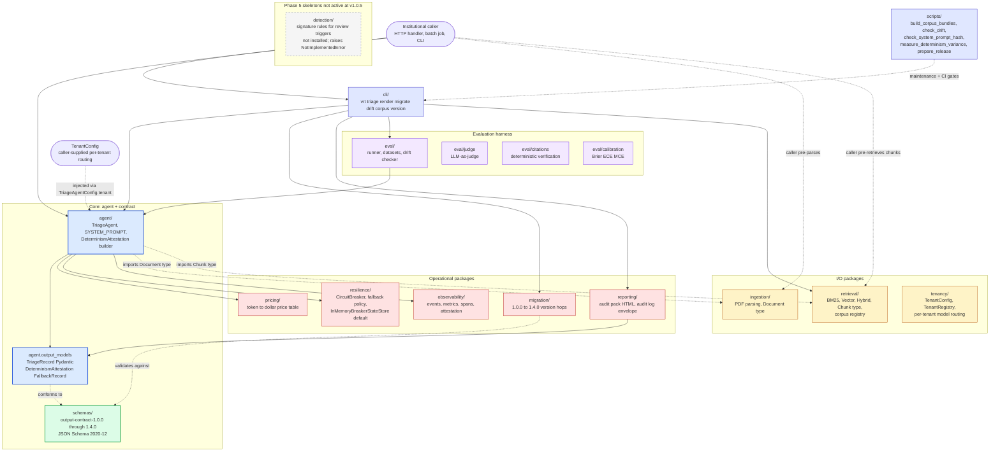
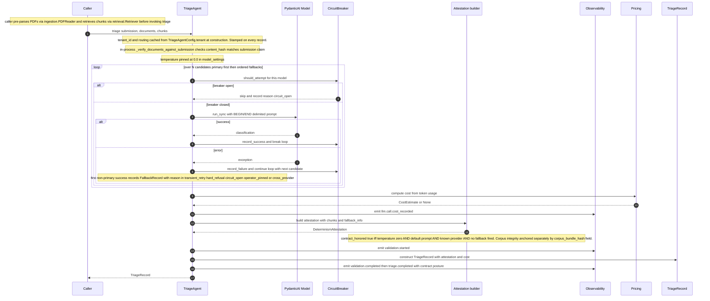
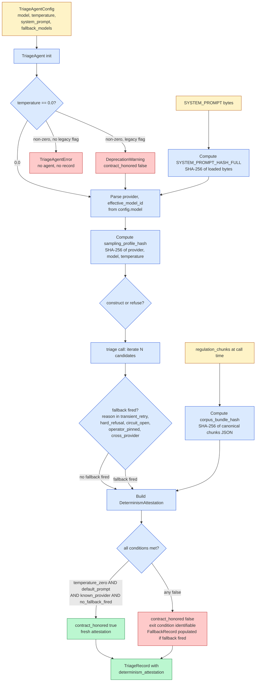
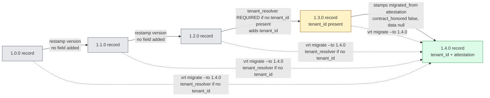
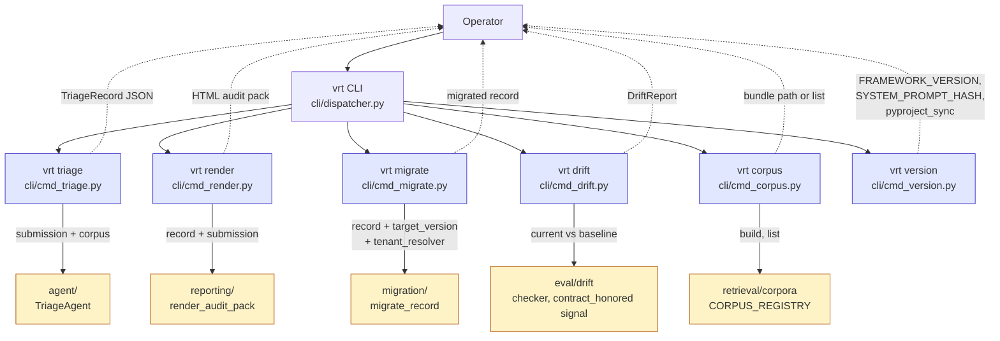
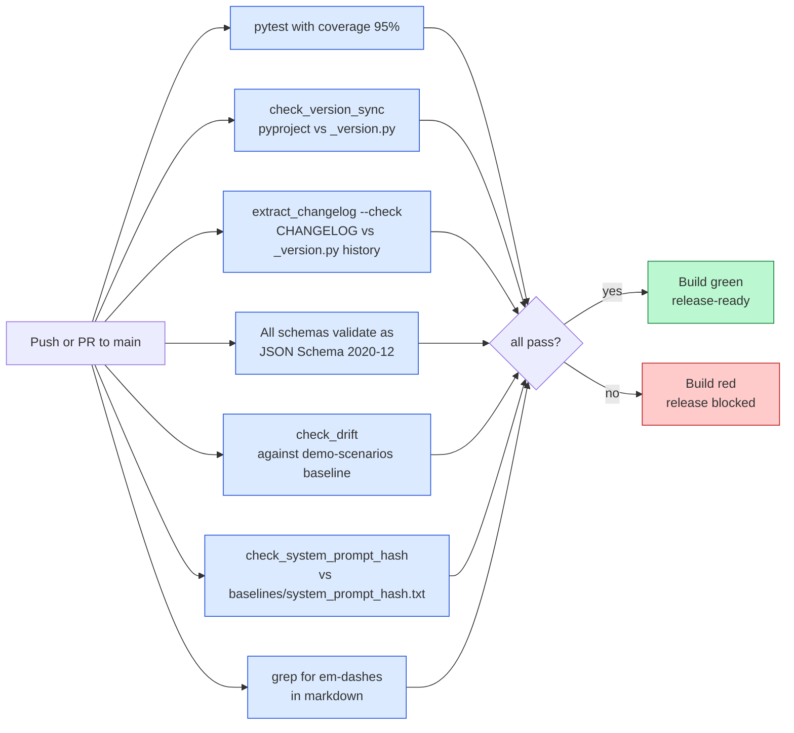
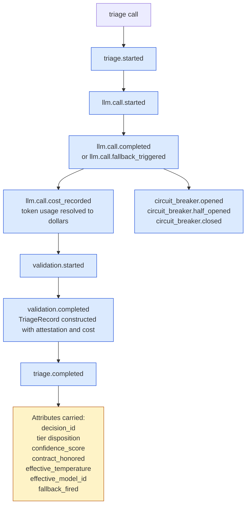

# System architecture (v1.0.5)

The Vendor Risk Triage framework ships eleven runtime Python packages
(`agent`, `cli`, `eval`, `ingestion`, `migration`, `observability`,
`pricing`, `reporting`, `resilience`, `retrieval`, `tenancy`) plus a
`schemas/` directory of JSON Schema contract files, a `scripts/`
directory of maintenance and CI helpers, and a `detection/` Phase 5
skeleton not yet operational at v1.0.5. The framework is state-free at
the contract boundary: callers supply inputs, the framework returns
outputs. No HTTP, no database, no scheduled jobs; those concerns belong
to the deployment architecture (see
`docs/phase-2/01-system-architecture.md` for the institutional shape).

The framework is NOT process-stateless in the strict sense: the
default `resilience.InMemoryBreakerStateStore` carries cross-call
failure history inside each TriageAgent instance for circuit-breaker
decisions, and that state is lost on process restart. Deployments
wanting shared breaker state across workers inject a custom
`BreakerStateStore` (e.g. Redis or Postgres-backed) per
`resilience/circuit_breaker.py`. The Composition section below
enumerates breaker state as a concern the deployment can choose to
externalize.

This document is the visual anchor for the current (v1.0.5) framework
at the package level. The Phase 2 architecture diagram covers the
foundational design; this one covers how the framework's runtime
packages compose AND how the determinism contract (introduced 1.0.5,
output contract 1.4.0) flows through them.

## Package decomposition

## Submission to record (the triage path)

The default flow callers exercise. Includes the determinism attestation
builder added in 1.0.5.

## Determinism contract flow

The determinism contract introduced in 1.0.5 cuts across the framework.
Every record carries an attestation; the configuration that produced
it determines whether `contract_honored` is true or false.

Note: `corpus_bundle_hash` is recorded on every attestation as an
audit anchor, but the contract_honored boolean does NOT include a
bundle-equality check against a deployment-specified expected hash.
Operators wanting end-to-end corpus pinning compare
`corpus_bundle_hash` against their own committed expected value
out-of-band. See `docs/determinism-attestation.md` for the contract
text.

## Migration paths

## CLI surface

## CI gates

The framework's CI enforces the contract on every push.

## Observability event taxonomy

The framework emits structured events at each stage of the triage call.
Sinks compose observability by filtering on event_name and attributes.

## Composition with the deployment architecture

The framework's eleven runtime packages compose into the deployment
shape specified in `docs/phase-2/01-system-architecture.md`. The
relationship:

- The **framework library** (this repo) handles classification,
  validation, retrieval type plumbing, cost accounting, fallback,
  observability event emission, audit pack rendering, audit log
  envelope construction, and migration.
- The **deployment architecture** (institutional shape) handles HTTP
  transport, normalization, PII detection, Postgres storage, audit
  query API, retention enforcement, and the trust boundary controls.

Per ADR-008, the framework intentionally carries no HTTP, no database,
no scheduled jobs. A deploying institution wires the framework into
the deployment architecture.

Statefulness the deployment must consider:

- **Circuit-breaker state.** The default `InMemoryBreakerStateStore`
  in `resilience/` carries per-model failure history inside each
  TriageAgent instance lifetime. On process restart, the breaker
  forgets which providers were unhealthy and retries them
  immediately. Deployments running long-lived workers benefit from
  injecting a shared store (Redis, Postgres) so breaker decisions
  span workers and survive restarts.
- **Caller-side parsing and retrieval state.** The agent does NOT
  parse PDFs or run retrieval itself. Callers exercise
  `ingestion.PDFReader` and `retrieval.Retriever` upstream and pass
  pre-built `Document` and `Chunk` instances. Caching, document
  storage, and corpus warm-up belong to the caller's deployment.
- **Tenancy.** A `TenantConfig` is bound to a single TriageAgent
  instance at construction. A multi-tenant deployment instantiates
  one agent per tenant (or pools agents per tenant); the framework
  does not multiplex tenants on one agent instance.

## Cross-references

- Phase 2 system architecture (foundational): `docs/phase-2/01-system-architecture.md`
- Trust boundaries: `docs/phase-2/02-trust-boundaries.md`
- Threat model: `docs/phase-2/03-threat-model.md`
- Architecture decisions: `docs/phase-2/04-architecture-decisions.md`
- Data model: `docs/data-model.md`
- Determinism contract: `docs/determinism-attestation.md`
- Tenancy guide: `docs/multi-tenancy-guide.md`
- Migration guide: `docs/migration-guide.md`
- Fallback guide: `docs/model-fallback-guide.md`
- Observability guide: `docs/observability-guide.md`
- Audit log shipping: `docs/audit-log-shipping.md`
- Cost tracking: `docs/cost-tracking-guide.md`
- Customization: `docs/customization-guide.md`
- Maintenance workflow: `docs/maintenance-workflow.md`
